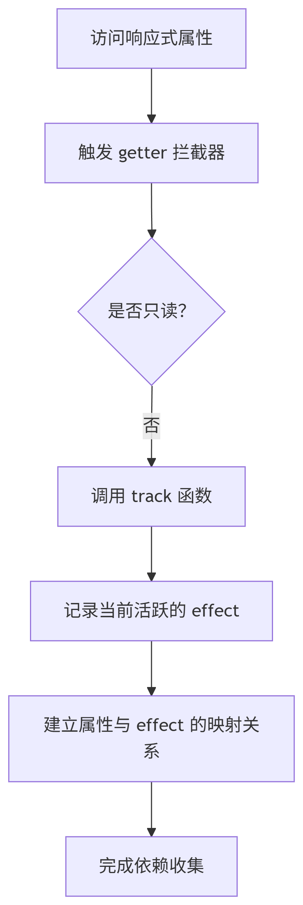

### 依赖收集
依赖收集是 Vue 响应式系统的核心机制，它负责追踪数据属性和副作用函数（如组件的渲染函数）之间的关系，确保当数据变化时能精确触发相关更新。

依赖收集的核心原理
在 Vue 中，依赖收集是通过读取操作触发的。当访问响应式对象的属性时，系统会记录"谁（哪个副作用函数）在读取这个属性"，从而建立依赖关系。



### dep.ts
#### Dep类功能
``` ts
class Dep {
   version = 0
  /**
   * 此dep与当前活跃effect之间的链接
   */
  activeLink?: Link = undefined

  /**
   * 表示订阅effects的双向链表（尾部）
   */
  subs?: Link = undefined

  /**
   * 表示订阅effects的双向链表（头部）
   * 仅在开发环境使用，用于按正确顺序调用onTrigger钩子
   */
  subsHead?: Link

  /**
   * 用于对象属性deps清理
   */
  map?: KeyToDepMap = undefined
  key?: unknown = undefined

  /**
   * 订阅者计数器
   */
  sc: number = 0

  /**
   * @internal
   */
  readonly __v_skip = true
  // TODO isolatedDeclarations ReactiveFlags.SKIP

  constructor(public computed?: ComputedRefImpl | undefined) {
    if (__DEV__) {
      this.subsHead = undefined
    }
  }

  // 生成一个双向链表结构Link
  track(debugInfo?: DebuggerEvent) {
    // 如果没有活跃的订阅者或不应该追踪，则返回
    if (!activeSub || !shouldTrack || activeSub === this.computed) {
      return
    }

    let link = this.activeLink
    if (link === undefined || link.sub !== activeSub) {
      // 创建新的链接
      link = this.activeLink = new Link(activeSub, this)

      // 将链接添加到activeEffect的deps中（作为尾部）
      if (!activeSub.deps) {
        activeSub.deps = activeSub.depsTail = link
      } else {
        link.prevDep = activeSub.depsTail
        activeSub.depsTail!.nextDep = link
        activeSub.depsTail = link
      }

      addSub(link)
    } else if (link.version === -1) {
      // 重用上次运行的链接 - 已经是订阅者，只需同步version
      link.version = this.version

      // 如果此dep有next，意味着它不在尾部 - 将其移动到尾部
      // 这确保effect的dep列表按照它们在评估期间被访问的顺序排列
      if (link.nextDep) {
        const next = link.nextDep
        next.prevDep = link.prevDep
        if (link.prevDep) {
          link.prevDep.nextDep = next
        }

        link.prevDep = activeSub.depsTail
        link.nextDep = undefined
        activeSub.depsTail!.nextDep = link
        activeSub.depsTail = link

        // 这是头部 - 指向新的头部
        if (activeSub.deps === link) {
          activeSub.deps = next
        }
      }
    }

    if (__DEV__ && activeSub.onTrack) {
      activeSub.onTrack(
        extend(
          {
            effect: activeSub,
          },
          debugInfo,
        ),
      )
    }

    return link
  }

   trigger(debugInfo?: DebuggerEventExtraInfo): void {
    // 增加版本号
    this.version++
    globalVersion++
    this.notify(debugInfo)
  }

  notify(debugInfo?: DebuggerEventExtraInfo): void {
    // 开始批处理
    startBatch()
    try {
      if (__DEV__) {
        // subs按相反顺序通知和批处理，然后在批处理结束时按原始顺序调用
        // 但onTrigger钩子应该在这里按原始顺序调用
        for (let head = this.subsHead; head; head = head.nextSub) {
          if (head.sub.onTrigger && !(head.sub.flags & EffectFlags.NOTIFIED)) {
            head.sub.onTrigger(
              extend(
                {
                  effect: head.sub,
                },
                debugInfo,
              ),
            )
          }
        }
      }
      // 从尾部开始遍历所有订阅者
      for (let link = this.subs; link; link = link.prevSub) {
        if (link.sub.notify()) {
          // 如果notify()返回`true`，这是一个computed
          // 也调用其dep的notify - 在这里调用而不是在computed的notify内部
          // 以减少调用栈深度
          ;(link.sub as ComputedRefImpl).dep.notify()
        }
      }
    } finally {
      endBatch()
    }
  }
}
```

#### track
``` ts
export function track(target: object, type: TrackOpTypes, key: unknown): void {
  if (shouldTrack && activeSub) {
    // 1. 获取或创建目标对象的依赖映射
    let depsMap = targetMap.get(target)
    if (!depsMap) {
      targetMap.set(target, (depsMap = new Map()))
    }
    
    // 2. 获取或创建特定属性的依赖集合
    let dep = depsMap.get(key)
    if (!dep) {
      depsMap.set(key, (dep = new Dep()))
      dep.map = depsMap  // 反向引用，便于调试
      dep.key = key      // 记录属性名
    }
    
    // 3. 收集当前活跃的副作用
    if (__DEV__) {
      dep.track({ target, type, key }) // 开发环境带调试信息
    } else {
      dep.track() // 生产环境直接收集
    }
  }
}
```
工作流程：
1. 条件检查：只有满足 shouldTrack（允许追踪）且存在活跃副作用（activeSub）时才会收集
2. 获取依赖映射：
   - 从全局 targetMap 中获取对象的依赖映射 depsMap
   - 如果对象不存在，则创建新的 Map 并存储
3. 获取依赖集合：
   - 从 depsMap 中获取属性的依赖集合 dep
   - 如果属性不存在，则创建新的 Dep 实例
4. 收集依赖：
   - 调用 dep.track() 将当前活跃副作用添加到集合中

#### trigger
``` ts
export function trigger(
  target: object,
  type: TriggerOpTypes,
  key?: unknown,
  newValue?: unknown,
  oldValue?: unknown,
  oldTarget?: Map<unknown, unknown> | Set<unknown>,
): void {
  // 1. 获取目标对象的依赖映射
  const depsMap = targetMap.get(target)
  if (!depsMap) {
    globalVersion++ // 全局版本号更新
    return
  }

  // 辅助函数：触发单个依赖集合
  const run = (dep: Dep | undefined) => {
    if (dep) {
      if (__DEV__) {
        dep.trigger({ target, type, key, newValue, oldValue, oldTarget })
      } else {
        dep.trigger()
      }
    }
  }

  startBatch() // 开始批量更新

  // 2. 根据操作类型处理不同触发逻辑
  if (type === TriggerOpTypes.CLEAR) {
    // 集合被清空：触发所有依赖
    depsMap.forEach(run)
  } else {
    const targetIsArray = isArray(target)
    const isArrayIndex = targetIsArray && isIntegerKey(key)

    if (targetIsArray && key === 'length') {
      // 数组长度变化
      const newLength = Number(newValue)
      depsMap.forEach((dep, key) => {
        if (
          key === 'length' ||
          key === ARRAY_ITERATE_KEY ||
          (!isSymbol(key) && key >= newLength)
        ) {
          run(dep)
        }
      })
    } else {
      // 常规属性变化
      if (key !== void 0 || depsMap.has(void 0)) {
        run(depsMap.get(key))
      }

      // 处理数组索引变化
      if (isArrayIndex) {
        run(depsMap.get(ARRAY_ITERATE_KEY))
      }

      // 3. 特殊集合操作处理
      switch (type) {
        case TriggerOpTypes.ADD:
          if (!targetIsArray) {
            run(depsMap.get(ITERATE_KEY))
            if (isMap(target)) {
              run(depsMap.get(MAP_KEY_ITERATE_KEY))
            }
          } else if (isArrayIndex) {
            run(depsMap.get('length'))
          }
          break
        case TriggerOpTypes.DELETE:
          if (!targetIsArray) {
            run(depsMap.get(ITERATE_KEY))
            if (isMap(target)) {
              run(depsMap.get(MAP_KEY_ITERATE_KEY))
            }
          }
          break
        case TriggerOpTypes.SET:
          if (isMap(target)) {
            run(depsMap.get(ITERATE_KEY))
          }
          break
      }
    }
  }

  endBatch() // 结束批量更新
}
```
核心作用：

- 在响应式数据变更时调用
- 根据变更类型查找并触发相关的依赖
- 使用批处理机制优化多次变更的触发效率

`trigger`分别进行了数组特殊处理/常规化属性变化/集合操作特殊处理/删除属性/设置属性 五种情况下的批量更新机制
而这一更新机制又建立在`effect`的基础上，如调用了`effect`的`startBatch`和`endBatch`方法， 是否收集也需要依赖`effect`的`activeSub`和`shouldTrack`。

### effect.ts

``` ts
export class ReactiveEffect<T = any> implements Subscriber {
  // 核心属性
  deps?: Link = undefined       // 依赖链表头
  depsTail?: Link = undefined   // 依赖链表尾
  flags: EffectFlags            // 状态标志
  fn: () => T                   // 副作用函数
  
  // 生命周期方法
  run(): T { /* 执行副作用函数 */ }
  stop(): void { /* 停止副作用 */ }
  trigger(): void { /* 触发副作用执行 */ }
}
```

核心作用：

- 封装需要响应式执行的函数（如组件渲染函数）
- 管理自身依赖的响应式数据
- 提供执行、暂停、恢复和停止的能力

#### batch
``` ts
export function batch(sub: Subscriber, isComputed = false): void {
  sub.flags |= EffectFlags.NOTIFIED
  // 添加到批处理队列
  ...
}

export function startBatch(): void {
  batchDepth++
}

export function endBatch(): void {
  if (--batchDepth > 0) return
  
  ...
  // 执行批处理队列中的所有 effect
  while (batchedSub) {
    const e = batchedSub
    batchedSub = batchedSub.next
    e.flags &= ~EffectFlags.NOTIFIED
    if (e.flags & EffectFlags.ACTIVE) {
      (e as ReactiveEffect).trigger()
    }
  }
}
```

### 总结

1. Effect 依赖于 Track 收集的依赖：

   - Effect 运行时通过 track 收集自己依赖的数据
   - 这些依赖存储在 Effect 的依赖链表中

2. Track 依赖于当前活跃 Effect：

   - track 函数依赖全局 activeSub 确定当前收集的 effect
   - 只有活跃的 effect 才会被收集为依赖

3. Trigger 依赖于 Track 建立的依赖映射：

   - trigger 通过 targetMap 查找数据变更影响的 effect
   - 依赖 Track 建立的数据结构（WeakMap → Map → Dep）

4. Effect 的执行由 Trigger 驱动：

   - 数据变更时，trigger 通知相关 effect 执行
   - Effect 根据自身状态决定执行方式（立即执行或加入队列）