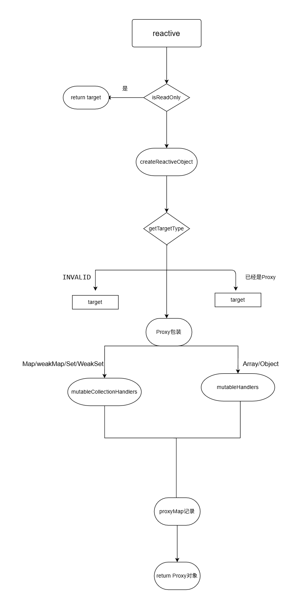

### 响应式系统核心文件结构（packages/reactivity）

``` md
reactivity/
├── src/
│   ├── reactive.ts         // reactive API 实现
│   ├── effect.ts           // effect 实现、副作用收集
│   ├── baseHandlers.ts     // Proxy handlers（响应式拦截）
│   ├── collectionHandlers.ts // Set、Map 等集合类型的响应式处理
│   ├── ref.ts              // ref/reactive toRef 等
│   ├── computed.ts         // computed 实现
│   ├── reactiveEffect.ts   // ReactiveEffect 类
│   └── ...                 // 其他辅助模块
```

当写入`const test = reactive({ a: 1 })`时会进行一下时序流程



当对象`test`被传入后,会进行以下操作


``` ts
export function reactive(target: object) {
  // if trying to observe a readonly proxy, return the readonly version.
  if (isReadonly(target)) {
    return target
  }
  return createReactiveObject(
    target,
    false,
    mutableHandlers,
    mutableCollectionHandlers,
    reactiveMap, // 代理对象的缓存 WeakMap类型
  )
}
```

核心代码为createReactiveObject，抛去一些边界情况，核心代码为

``` ts
function createReactiveObject(
  target: object,
  isReadonly: boolean,
  baseHandlers: ProxyHandler<any>,
  collectionHandlers: ProxyHandler<any>,
  proxyMap: WeakMap<object, any>
) { 
  // 省略一些边界情况

  // 获取对象类型
  const targetType = getTargetType(target)
  if (targetType === TargetType.INVALID) {
    return target
  }
  // 如果对象已经被代理过，则直接返回代理对象
  const existingProxy = proxyMap.get(target)
  if (existingProxy) {
    return existingProxy
  }

  // 创建代理对象， 
  // 如果传入的对象是`Map`、`Set`、`WeakMap`、`WeakSet`等集合类型，则使用`collectionHandlers`，否则使用`baseHandlers`
  const proxy = new Proxy(
    target,
    targetType === TargetType.COLLECTION ? collectionHandlers : baseHandlers,
  )

  proxyMap.set(target, proxy)

  return proxy
}
```

`baseHandlers` 和 `collectionHandlers`  用于拦截对象的属性读取和写入

暂时先看`baseHandlers`，在`packages\reactivity\src\baseHandlers.ts`

baseHandlers 由 `MutableReactiveHandler` 构造， `MutableReactiveHandler`继承自 `BaseReactiveHandler`

```ts

/**
 * 基础响应式处理器类
 * 实现了 Proxy 的基本处理器接口
 */
class BaseReactiveHandler implements ProxyHandler<Target> {
  constructor(
    protected readonly _isReadonly = false,
    protected readonly _isShallow = false,
  ) {}

  /**
   * 拦截对象属性的读取操作
   * @param target 目标对象
   * @param key 要读取的属性名
   * @param receiver 代理对象本身
   */
  get(target: Target, key: string | symbol, receiver: object): any {
    // 特殊标志处理
    // 处理 Vue 内部使用的特殊 Symbol 属性，用于检查对象类型（响应式/只读/浅层）
    if (key === ReactiveFlags.SKIP) return target[ReactiveFlags.SKIP]
    const isReadonly = this._isReadonly,
      isShallow = this._isShallow
    if (key === ReactiveFlags.IS_REACTIVE) {
      return !isReadonly
    } else if (key === ReactiveFlags.IS_READONLY) {
      return isReadonly
    } else if (key === ReactiveFlags.IS_SHALLOW) {
      return isShallow
    } else if (key === ReactiveFlags.RAW) {
      if (
        receiver ===
          (isReadonly
            ? isShallow
              ? shallowReadonlyMap
              : readonlyMap
            : isShallow
              ? shallowReactiveMap
              : reactiveMap
          ).get(target) ||
        // receiver is not the reactive proxy, but has the same prototype
        // this means the receiver is a user proxy of the reactive proxy
        Object.getPrototypeOf(target) === Object.getPrototypeOf(receiver)
      ) {
        return target
      }
      // early return undefined
      return
    }

    const targetIsArray = isArray(target)

    if (!isReadonly) {
      let fn: Function | undefined
      // 对数组方法进行了重写，主要书对数组进行了一个相应式的处理操作
      if (targetIsArray && (fn = arrayInstrumentations[key])) {
        return fn
      }
      if (key === 'hasOwnProperty') {
        return hasOwnProperty
      }
    }

    const res = Reflect.get(
      target,
      key,
      // if this is a proxy wrapping a ref, return methods using the raw ref
      // as receiver so that we don't have to call `toRaw` on the ref in all
      // its class methods
      isRef(target) ? target : receiver,
    )
    if (isSymbol(key) ? builtInSymbols.has(key) : isNonTrackableKeys(key)) {
      return res
    }

    // 在读取属性时调用 track 函数收集当前依赖（对应 effect 函数）
    if (!isReadonly) {
      track(target, TrackOpTypes.GET, key)
    }

    if (isShallow) {
      return res
    }

    // 自动解包 ref 值（数组索引除外），避免在模板中需要 .value
    // ex: const count = ref(0)
    // const obj = reactive({ count })
    // 当访问 obj.count 时
    // console.log(obj.count)  // 直接得到 0，而不是 ref 对象
    if (isRef(res)) {
      // ref unwrapping - skip unwrap for Array + integer key.
      return targetIsArray && isIntegerKey(key) ? res : res.value
    }

    if (isObject(res)) {
      // Convert returned value into a proxy as well. we do the isObject check
      // here to avoid invalid value warning. Also need to lazy access readonly
      // and reactive here to avoid circular dependency.
      return isReadonly ? readonly(res) : reactive(res)
    }

    // 当在页面上使用 test.a 时，会触发 get 方法， 返回 res
    return res
  }
}

/**
 * MutableReactiveHandler 类：处理可变响应式对象的代理处理器
 * 继承自 BaseReactiveHandler，用于实现普通对象的响应式代理
 */
class MutableReactiveHandler extends BaseReactiveHandler {
  constructor(isShallow = false) {
    super(false, isShallow)
  }

  /**
   * 拦截对象属性的设置操作
   * @param target 目标对象
   * @param key 要设置的属性名
   * @param value 要设置的新值
   * @param receiver 代理对象本身
   */
  set(
    target: Record<string | symbol, unknown>,
    key: string | symbol,
    value: unknown,
    receiver: object,
  ): boolean {
    let oldValue = target[key]
    if (!this._isShallow) {
      const isOldValueReadonly = isReadonly(oldValue)
      // 如果不是浅层响应式，需要处理嵌套对象的响应式
      if (!isShallow(value) && !isReadonly(value)) {
        oldValue = toRaw(oldValue)
        value = toRaw(value)
      }
      // 处理 ref 的特殊情况
      if (!isArray(target) && isRef(oldValue) && !isRef(value)) {
        if (isOldValueReadonly) {
          return false
        } else {
          oldValue.value = value
          return true
        }
      }
    } else {
      // 浅层响应式模式下，对象直接设置，不进行响应式转换
    }

    // 判断属性是否存在
    const hadKey =
      isArray(target) && isIntegerKey(key)
        ? Number(key) < target.length
        : hasOwn(target, key)

    // 使用 Reflect.set 设置属性值
    // Reflect 是 ES6 引入的新特性，用于操作对象
    // 相比直接操作对象，Reflect 提供了更规范的对象操作方法
    // 1. 更函数化的编程方式
    // 2. 更可靠的返回值（操作成功返回 true，失败返回 false）
    // 3. 可以接收 receiver 参数，用于指定 this 的指向
    const result = Reflect.set(
      target,
      key,
      value,
      isRef(target) ? target : receiver,
    )

    // 只有当操作的是代理对象本身而不是原型链上的对象时才触发更新
    if (target === toRaw(receiver)) {
      if (!hadKey) {
        // 新增属性时触发 ADD 操作
        trigger(target, TriggerOpTypes.ADD, key, value)
      } else if (hasChanged(value, oldValue)) {
        // 修改属性时触发 SET 操作
        trigger(target, TriggerOpTypes.SET, key, value, oldValue)
      }
    }
    return result
  }

  /**
   * 拦截对象属性的删除操作
   * @param target 目标对象
   * @param key 要删除的属性名
   */
  deleteProperty(
    target: Record<string | symbol, unknown>,
    key: string | symbol,
  ): boolean {
    ......
  }

  /**
   * 拦截 in 操作符
   * @param target 目标对象
   * @param key 要检查的属性名
   */
  has(target: Record<string | symbol, unknown>, key: string | symbol): boolean {
    ......
  }

  /**
   * 拦截 Object.keys() 等操作
   * @param target 目标对象
   */
  ownKeys(target: Record<string | symbol, unknown>): (string | symbol)[] {
    ......
  }
}

```

其中读写操作又涉及到一个核心的功能，就是**依赖收集**


